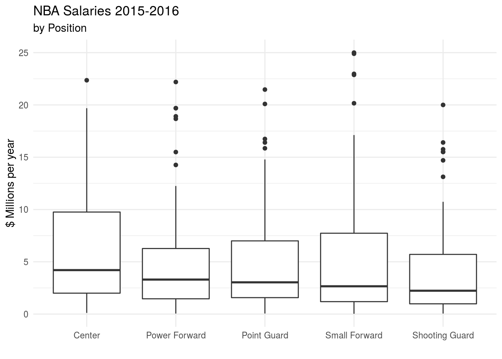

DATA 101 Exam 1 (Fall 2020)
================

## Rules

1.  Your solutions must be written up in the R Markdown (Rmd) file
    called `exam-01.Rmd`. This file must include your code and write up
    for each task. **You should commit and push to GitHub after you
    complete each problem, at a minimum**. Exam points will be allocated
    for GitHub usage. You must submit the PDF output (exam-01.pdf) to
    Gradescope by **11:59pm on Monday, October 26th**.

2.  This exam is open book, open internet, closed other people. You may
    use any online or book-based resource you would like, but you must
    include citations for any code that you use (directly or
    indirectly). You **may not** consult with anyone else about this
    exam other than Dr. Yuster. You cannot ask or answer questions on
    the internet, or consult with each other, not even for hypothetical
    questions.

3.  You have until **11:59pm on Monday, October 26th** to complete this
    exam and turn it in to GitHub and Gradescope - late work will
    **not** be accepted. Technical difficulties are **not** an excuse
    for late work - do not wait until the last minute to knit / commit /
    push.

4.  Each question requires a (brief) narrative and/or a (brief)
    description of your approach, as indicated in the question. You can
    use comments in your code, but do not extensively count on these. I
    should be able to suppress **all** the code in your document and
    still be able to read and make sense of your answers. See the first
    setup code chunk in your Rmd file to experiment with suppressing and
    revealing your code.

5.  Even if the answer seems obvious from the R output, make sure to
    state it in your narrative as well. For example, if the question is
    asking what is 2 + 2, and you have the following in your document,
    you should additionally have a sentence that states “2 + 2 is 4.”

<!-- end list -->

``` r
2 + 2
# 4
```

6.  You may only use `tidyverse` (and its dependencies) for this
    assignment. Your solutions may not use any other R packages.

## Academic Integrity Statement

*I, \_\_\_\_\_\_\_\_\_\_\_\_, hereby state that I have not communicated
with or gained information in any way from my classmates or anyone other
than the Professor or TA during this exam, and that all work is my own.*

**A note on sharing / reusing code:** I am well aware that a huge volume
of code is available on the web to solve any number of problems. For
this exam you are allowed to make use of any online resources
(e.g. StackOverflow) but you must explicitly cite where you obtained
any code you directly use (or use as inspiration). You are also not
allowed to ask a question on an external forum, you can only use answers
to questions that have already been answered prior to 10/23/20. Any
recycled code that is not explicitly cited will be treated as
plagiarism. All communication with classmates is explicitly forbidden.

## Getting help

You are not allowed to post any questions on Piazza. Any questions about
the exam must be asked in person in office hours or via email to the
professor.

## Grading and feedback

Each question is worth 10 points, which includes code style, commit
frequency and messages, overall organization, spelling, grammar, etc.

## Logistics

Clone this project in our RStudio Cloud **course workspace**. Answer the questions in the document called `exam-01.Rmd`. Add your code
and narrative in the spaces below each question. Add code chunks as
needed. Use as many lines as you need, but keep your narrative concise.

Before completing, make sure to suppress the code and look over your
answers one more time. If the narrative seems sparse or choppy, edit as
needed. Then, revert back to revealing your code.

## Packages

The `tidyverse` package is already installed in our course workspace,
but you will need to load it.

## The data

For this exam, we will be working with data from the 2015-2016 NBA
(National Basketball Association) season.

In the `/data` folder of your repo, you will find the following file:

  - `nba_salaries.csv`: Player, team, position, and salary info (in
    millions of dollars) from the 2015-2016 season.

Positions are:

  - C: Center
  - PG: Point guard
  - SG: Shooting guard
  - PF: Power forward
  - SF: Small forward

Run the following code to read in the data:

``` r
nba <- read_csv("data/nba_salaries.csv")
```

In doing your analysis, **do not** overwrite or modify the `nba` data
frame. Rather, you can make temporary adjustments (without saving them),
or create new named data frames, as needed.

## Questions

1.  **Question 1** Who were the highest paid players in the NBA in
    2015-2016? Make a table that lists players in descending order of
    salary.

2.  **Question 2** (a) Recreate the following plot. Hint: you can
    relabel the x-axis using the `scale_x_discrete` function. (b)
    Analyze the plot in a few lines. Your analysis should include some
    of the following words, as appropriate: mean, median, outlier,
    spread, range, etc.



3.  **Question 3** How many players of each position are there? Create
    both a table and a visualization which show the answer.

4.  **Question 4** Create a histogram which shows the distribution of
    player salaries. Write a sentence or two about the results.

5.  **Question 5** What was the average player salary for each team?
    Create a table which displays this information from highest to
    lowest average salary, for the 10 highest-paying teams. In your
    narrative, report on the three highest-paying teams.

6.  **Question 6** Starting from `nba`, create a data frame which
    contains a variable `salary_level` with the following values: “Low”
    for players earning less than $8M, “Moderate” for players earning at
    least $8M but less than $16M, and “High” for players earning at
    least $16M. (b) Calculate the proportion of players at each salary
    level (using the appropriate summarizing and wrangling functions).
    Report your findings in the narrative.

7.  **Question 7** Starting from `nba`, create a table which displays
    each team’s “starting lineup” salaries, which we’ll define as the
    salaries of the team’s highest-paid player in each position. In
    other words, your table should contain one row for each team and
    position, displaying the salary of the team’s highest-paid player in
    that position. The data frame will have 3 variables (containing the
    team, position, and highest salary in that position on that team).
    Call the resulting data frame `starters`. It should be displayed in
    alphabetical order by team name, then position. In the narrative,
    give a brief description of your approach to this problem.

8.  **Question 8** Add a column with the appropriate player names to the
    `starters` data frame created in the previous question. Hint: you
    will need to **join** the `starters` data frame to the full `nba`
    data frame. The resulting data frame should be called `starters`
    again. In the narrative, give a brief description of your approach
    to this problem.

9.  **Question 9** Suppose we’d like to know whether any of the teams
    have multiple starters (highest-paid players) in a single position.
    For example, the Indiana Pacers have a two-way tie for their
    highest-paid Center, with centers Jordan Hill and Ian Mahinmi each
    being paid $4M. How could we detect such ties in the `starters`
    table you just created? Describe (in narrative) one or more methods.
    Then write code to carry out one of your ideas, and state the
    conclusion (any ties you found).

10. **Question 10** Create a new data frame called `starters_unique`,
    which has Ian Mahinmi’s row removed from `starters`, so there are no
    longer any ties. Next, use a pivot function to display the
    information in `starters_unique` in a more human-friendly format.
    The resulting table should have one row per team and one column per
    position (PG, SG, etc.), and the entries of the table should be the
    starting players’ names. In the narrative, give a brief description
    of your approach to this problem. Hints/Tips:

<!-- end list -->

  - If your `starters_unique` data frame is grouped, you will need to
    ungroup it before applying the pivot function.
  - We don’t need salary info for this question, so remove it before
    pivoting.
  - To print the entire table (all 30 teams’ starters), pipe your
    pivoted data frame into the knitr::kable() function.

When you have completed the exam, or before the deadline (whichever
comes first), knit, commit, and push to GitHub one final time. Then
download the PDF, and submit it to Gradescope.
