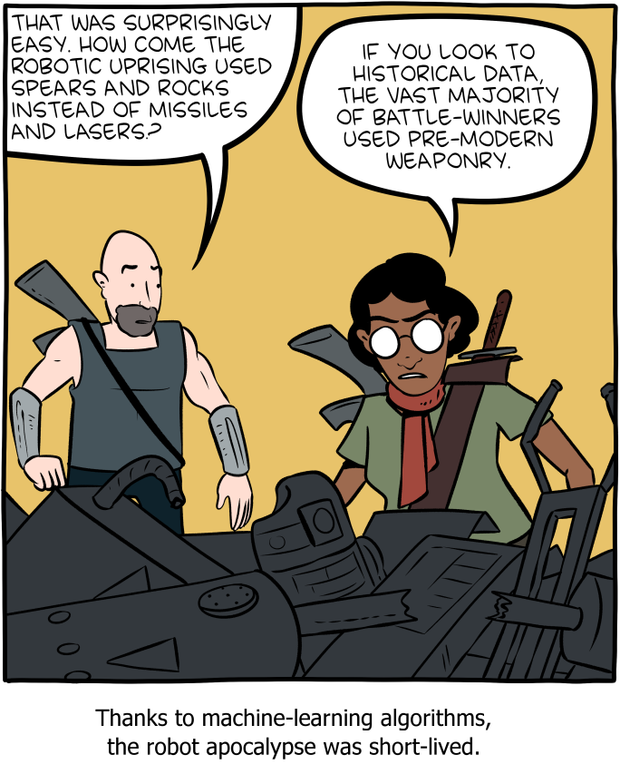

DATA 101 Exam 2 (Fall 2020)
================

## Rules

1.  Your solutions must be written up in the R Markdown (Rmd) file
    called `exam-02.Rmd`. This file must include your code and write up
    for each task. **You should commit and push to GitHub after you
    complete each problem, at a minimum**. Exam points will be allocated
    for GitHub usage. You must submit the PDF output (exam-02.pdf) to
    Gradescope by **11:59pm on Sunday, November 29th**.

2.  This exam is open book, open internet, closed other people. You may
    use any online or book-based resource you would like, but you must
    include citations for any code that you use (directly or
    indirectly). You **may not** consult with anyone else about this
    exam other than Dr. Yuster. You cannot ask or answer questions on
    the internet, or consult with each other, not even for hypothetical
    questions.

3.  You have until **11:59pm on Sunday, November 29th** to complete this
    exam and turn it in to GitHub and Gradescope - late work will
    **not** be accepted. Technical difficulties are **not** an excuse
    for late work - do not wait until the last minute to knit / commit /
    push.

4.  Each question requires a narrative, as indicated in the question.
    You can use comments in your code, but do not extensively count on
    these. Your narrative should show your understanding and insight. It
    should not be a restatement of your code.

5.  Even if the answer seems obvious from the R output, make sure to
    state it in your narrative as well. For example, if the question is
    asking what is 2 + 2, and you have the following in your document,
    you should additionally have a sentence that states “2 + 2 is 4.”

<!-- end list -->

``` r
2 + 2
# 4
```

6.  There are a number of allowed packages, listed below. You may not
    use any other R packages.

## Academic Integrity Statement

*I, \_\_\_\_\_\_\_\_\_\_\_\_, hereby state that I have not communicated
with or gained information in any way from my classmates or anyone other
than the Professor during this exam, and that all work is my own.*

**A note on sharing / reusing code:** I am well aware that a huge volume
of code is available on the web to solve any number of problems. For
this exam you are allowed to make use of any online resources
(e.g. StackOverflow) but you must explicitly cite where you obtained
any code you directly use (or use as inspiration). You are also not
allowed to ask a question on an external forum, you can only use answers
to questions that have already been answered prior to 11/22/20. Any
recycled code that is not explicitly cited will be treated as
plagiarism. All communication with classmates is explicitly forbidden.
Any resource you use aside from course materials/readings must be
explicitly cited.

## Getting help

You are not allowed to post any questions on Piazza. Any questions about
the exam must be asked in person in office hours or via email to the
professor.

## Grading and feedback

This exam contains 100 points. Point values are listed for each
question, which includes code style, overall organization, spelling,
grammar, etc. Additionally, 5 points will be allocated to GitHub usage.

## Logistics

Answer the questions in the document called `exam-02.Rmd`. Add your code
and narrative in the spaces below each question. Add code chunks as
needed. Use as many lines as you need, but keep your narrative concise.

## Packages

For this exam, you may use the following packages: tidyverse,
tidymodels, janitor, lubridate, NHANES. Be sure to load them.

## The data

For part of the exam, we’ll be working with data from the American
National Health and Nutrition Examination surveys (NHANES). You can read
about the data by typing `?NHANES` in the Console. The following code
chunk will load the data. You may wish to glimpse the data frame
(especially to check on the variable types), but do not output the
glimpse in your exam submission.

``` r
# Load in the data here
nhanes <- NHANES %>%
  janitor::clean_names()
# DO NOT OVERWRITE THIS TABLE DURING THE EXAM
```

You should not, at any point, redefine or overwrite the `nhanes` table.
Rather, you can make temporary adjustments, or create new named data
frames, as needed.

## Questions

In the first few questions, we will examine body mass index (BMI).
According to the
[CDC](https://www.cdc.gov/healthyweight/assessing/bmi/index.html), “Body
Mass Index (BMI) is a person’s weight in kilograms divided by the square
of height in meters.”

1.  **Question 1** (10 points) Create a visualization to explore the
    relationship between `bmi` and `height`, and another one to explore
    the relationship between `bmi` and `weight`. Following each plot,
    interpret the relationship, and offer an explanation/hypothesis of
    why this relationship might exist.

2.  **Question 2** (10 points) Fit a linear model called `bmi_fit` to
    predict BMI as a function of weight. Display the model output in
    tidy format. In the narrative, write the equation of the model, and
    interpret the coefficient of `weight` in the context of the data.

3.  **Question 3** (5 points) Compute the coefficient of determination
    for the model you fit above, and explain what it tells us.

4.  **Question 4** (10 points) Make a residual plot for the model fit
    above. In your narrative, use the residual plot to assess the model.

5.  **Question 5** (10 points) Fit a multiple linear regression model
    called `bp_fit` to predict systolic blood pressure (`bp_sys_ave`) as
    a function of weight, age, and gender. The model output should be in
    tidy form. In the narrative, write down (a) the model equation for
    males, and (b) the model equation for females. Then, use your model
    to predict the systolic blood pressure of a 60-year old man weighing
    200 pounds.

6.  **Question 6** (5 points) Fit a logistic regression model called
    `diabetes_fit` to predict whether a patient has diabetes, as a
    function of the patient’s age, gender, and BMI. Display the model
    output in tidy format. In your narrative, write the model equation
    that results directly from your model output.

7.  **Question 7** (5 points) Write a **function** called `inv_logit`
    that takes a number x as its argument, and returns the inverse-logit
    of x. In your narrative, describe what we could use this function
    for.

8.  **Question 8** (10 points) Use your logistic regression model to
    predict the diabetes status of a 55-year old woman with a BMI of 24.
    Your solution should make use of the `inv_logit` function you wrote
    above. Interpret your answer.

9.  **Question 9** (5 points) Suppose you have used your `diabetes_fit`
    model on five new patients, whose age, gender, and BMI have been
    entered into your model formula. The formula output for these 5
    patients is listed below:

<!-- end list -->

``` r
outputs = c(-2.20, 0.01, -0.35, 1.15, 0.83)
```

Use an appropriate **map** function to apply your `inv_logit` function
to each of these values, and show the output. In your narrative,
interpret the result for the third patient in the list.

10. **Question 10** (5 points) Logistic regression involves binary
    classification, and the user of the model must choose a threshold to
    use. (a) Make up an example binary classification situation where
    you might want to choose a relatively *high* threshold. (b) Make up
    an example binary classification situation where you might want to
    choose a relatively *low* threshold. Explain.

11. **Question 11** (5 points) In our lessons on webscraping, before
    scraping a page we checked for permission. Give two or more reasons
    why a site might *not* allow scraping of its data.

12. **Question 12** (5 points) Examine the cartoon below from the lesson
    on Algorithmic Bias. Explain how the cartoon is related to the
    Amazon hiring practices example discussed in the lesson.
    
    *([Source:](https://www.smbc-comics.com/comic/rise-of-the-machines)
    Saturday Morning Breakfast Cereal by Zach Weinersmith)*

13. **Question 13** (10 points) In the ‘data/’ folder of your repo, you
    will find a CSV file called people.csv. Read the file in, dealing
    appropriately with any missing or NA values. Use the appropriate R
    package/function to convert the variable names to snake case. Ensure
    each variable has the appropriate datatype. Height should be a
    factor with its levels ordered from shortest to tallest. Output your
    final tibble with rows ordered by increasing height. In your
    narrative, give a brief description of a *different* approach you
    could have taken to ensuring the columns had the appropriate data
    types.

When you have completed the exam, or before the deadline (whichever
comes first), knit, commit, and push to GitHub one final time. Then
download the PDF, and submit it to Gradescope.
